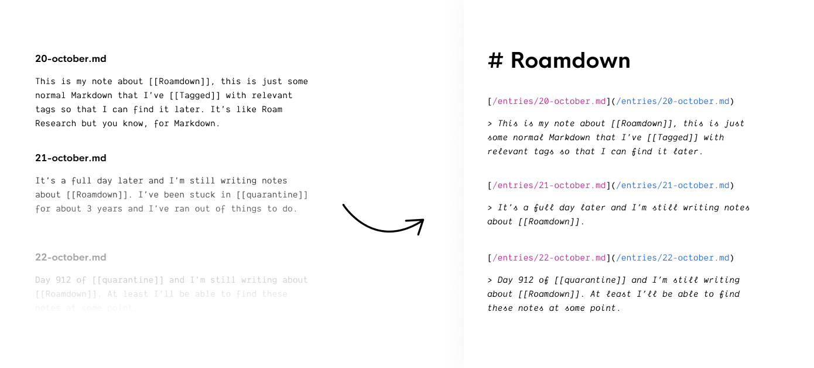

Roamdown parses your Markdown files and looks for [[wiki-links]]. Using the [[wiki-links]] it creates a Markdown file containing all references to the link as well as a snippet of the surrounding sentence to provide context to the link, I call these created files "tag files" since they bring together all content from a specific "tag" or "category".

The basic functionality is ~~stolen~~ heavily inspired from Roam Research. I started using Roam and liked the idea, however, I really disliked the writing experience. If you're like me and would prefer to write in your IDE but would like the grouping of related notes that Roam provides then this should do the trick.

## Usage

Roamdown has been designed to be used as a binary, the preferred use is to run:

```
$ npx roamdown
```

| Argument         | Description                                                 | Default    |
| ---------------- | ----------------------------------------------------------- | ---------- |
| --tagDirectory   | The directory where your tag files will be generated        | `/tags`    |
| --entryDirectory | The directory that Roamdown will look in to find your notes | `/entries` |
